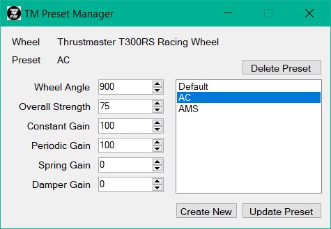
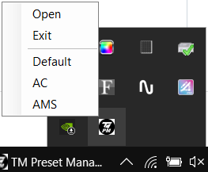

## TM-PresetManager
Preset Manager for Thrustmaster wheels

### Tested wheels
- Thrustmaster T300RS
- need some testing...

### How to use

- Download latest [Release](https://github.com/mitchell547/TM-PresetManager/releases)
- Unpack it into folder
- Run TM-PresetManager.exe
- Manage your Presets with GUI
- Set specific Preset by Double-Clicking it
- You can minimize application into System Tray and apply Presets from it

**NOTE**: Change preset BEFORE the game start up, otherwise changes will not be applied or FFB in game will disappear

### Requirements
- Windows 7 or higher
- .NET Framework 4.6.1 or higher
